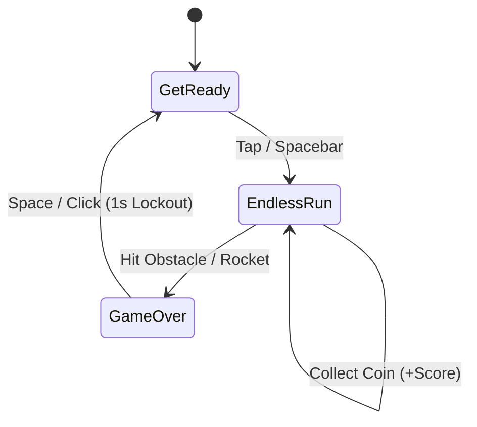
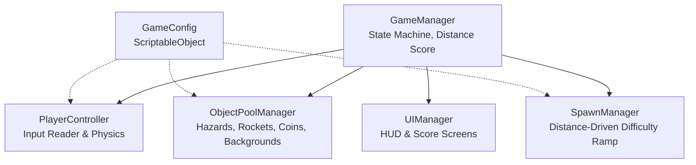

# Game Design Document — Jetpack Ride

| Field | Details |
|---|---|
| **Working title** | Jetpack Ride |
| **Team** | Nadav Simon, Alfredo Limin |
| **Genre** |Endless Runner|
| **Target platform** | PC |
| **Engine / Unity version** | Unity 6 (6000.3.12f1), URP 2D |
| **Orientation & reference resolution** | Landscape, 1920 × 1080 reference |
| **Expected session length** | 2 – 8 minutes |
| **Document version** | v1.1 — 2026-09-23 |

---

## 1. High Concept

An endless horizontal runner where players dodge obstacles using a one-touch jetpack and collect coins along the way. There are no vehicles, no boss fights, and no shop — the challenge is purely about going the distance. The longer the run lasts, the more obstacles and rockets appear, and the tighter their patterns become, forcing the player to keep improving their reflexes to survive.

### Design pillars

1. **Skill Over Progression** — Zero power-up shop or permanent stat upgrades. High scores depend entirely on reflex, timing, and pattern recognition. Coins are collected for score only.
2. **Escalating Challenge** — Obstacle and rocket frequency, speed, and density increase continuously with distance traveled, so the run naturally gets harder the longer the player survives.
3. **Unbroken Arcade Flow** — The world scrolls continuously with no scene transitions or loading screens, maintaining relentless forward momentum. The goal is simple: go the distance.

---

## 2. Reference & Inspiration

- **Primary Reference:** *Jetpack Joyride* (Halfbrick Studios).
  - **Taking:** Endless horizontal scrolling, one-touch continuous jetpack lift, coin collection for score.
  - **Not taking:** Vehicles, gadgets, character customization, spin tokens, or any shop/upgrade system.
- **Secondary Reference:** *Flappy Bird* (tight vertical obstacle gaps and one-touch input feel).
  - **Taking:** Simple one-button control scheme and the sense of mounting difficulty as the player progresses.

---

## 3. Core Game Loop

**Moment-to-moment rules:**

- **Continuous Movement:** The camera and environment scroll left continuously. Distance traveled acts as the primary score.
- **Jetpack Control:** Holding the action button applies upward vertical force; releasing it lets gravity pull the player down.
- **Coins:** Coins float in the scrolling environment in single pickups and short arcing chains that reward smooth flight paths through tight gaps. Collecting a coin adds to the run's coin total and score. Coins are cosmetic score only — there is no shop or currency bank between runs.
- **Escalating Difficulty:** As distance increases, obstacle and rocket spawn rate, speed, and pattern complexity all scale up on a continuous curve (see difficulty ramp below). There are no discrete "boss" events — the challenge is a smooth, ever-steepening climb.
- **Failure:** Touching any hazard (zap field, obstacle, rocket) results in immediate death and ends the run.

### Difficulty ramp

The run has no fixed checkpoints or set-piece encounters. Instead, difficulty is driven by a continuous function of distance traveled:

- **Spawn rate** for obstacles and rockets increases steadily with distance, shortening the gap between hazards over time.
- **World scroll speed** increases gradually with distance, giving the player less reaction time as the run goes on.
- **Rocket behavior** (frequency of homing/targeted rockets vs. simple straight-line rockets) shifts toward more aggressive patterns at higher distances.
- **Pattern mixing** — early distances spawn single, well-spaced hazards; later distances mix multiple obstacle types and rocket volleys in the same window, requiring the player to track several threats at once.

All of this is driven by distance-keyed curves (e.g. Animation Curves) rather than hardcoded milestones, so the difficulty increase feels smooth rather than stepped.

### Parameters you will need to tune

| Parameter | What it controls | First guess |
|---|---|---|
| `baseScrollSpeed` | World scroll velocity at run start | 12.0 u/s |
| `scrollSpeedPerMeter` | Scroll speed gained per meter traveled | +0.005 u/s per m |
| `maxScrollSpeed` | Cap on world scroll velocity | 26.0 u/s |
| `jetpackThrust` | Upward acceleration applied when holding primary input | 28.0 u/s² |
| `gravityScale` | Fall rate for the jetpack state | 3.8 |
| `baseObstacleSpawnInterval` | Time between obstacle spawns at run start | 1.8 s |
| `minObstacleSpawnInterval` | Floor for obstacle spawn interval at max difficulty | 0.6 s |
| `baseRocketSpawnInterval` | Time between rocket spawns at run start | 4.0 s |
| `minRocketSpawnInterval` | Floor for rocket spawn interval at max difficulty | 1.2 s |
| `difficultyRampDistance` | Meters over which difficulty scales from base to max | 2500 m |
| `coinValue` | Score added per coin collected | 5 pts |

**Where these live:** Centralized inside a `GameConfig` ScriptableObject referenced by `GameManager`, `PlayerController`, and `SpawnManager` for zero-recompile runtime tuning via Unity Inspector, including the distance-to-difficulty curves.

**Feel target:** A novice player can comfortably survive the opening ~500m at low difficulty; by ~2,000–2,500m the run reaches near-maximum spawn rate and speed, demanding sustained precision to keep going the distance.

---

## 4. Controls & Input

| Action | Keyboard / Mouse | Gamepad | Touch Screen |
|---|---|---|---|
| **Primary Action** (Jetpack Thrust) | Spacebar / Left Click | A Button / Right Trigger | Tap & Hold Anywhere |
| **Restart Game** | Spacebar / Left Click | A Button | Tap Screen |

- Input is polled during `Update()`, buffered as a struct state, and executed during `FixedUpdate()` to guarantee zero missed inputs across physics frame steps.
- UI Raycasting blocks gameplay input when interacting with screen overlay buttons.
- A **1.0-second input lockout** is enforced upon player death before restart inputs are registered, preventing accidental quick-restarts during rapid tapping.

---

## 5. Screens & UI

1. **Title / Start Screen** — Centered game logo ("Jetpack Ride"), high score counter, flashing "Press Space / Tap to Jetpack" prompt.
2. **HUD (In-Game)** —
   - Top-Right: Current Distance (`1,240 m`).
   - Top-Left: Coins Collected This Run.
   - *Deliberately absent:* Shop icons, currency bank, boss health bars, or active booster timers.
3. **Game Over Screen** — Overlay panel displaying Final Distance, Coins Collected, High Score indicator, and a prominent "Tap to Replay" button.

- **Canvas setup:** Screen Space – Camera, CanvasScaler *Scale With Screen Size*, reference 1920 × 1080, Match Width/Height = 0.5.

---

## 6. Art & Audio

| Asset | Description / Variants | Source & Licence | Use |
|---|---|---|---|
| **Player Sprites** | Main character animation frames (Fly, Die) | Custom 2D Vector / CC0 Asset Pack | Player visualization |
| **Coin Sprite** | Spinning coin pickup (single frame + spin animation) | Custom / OpenGameArt (CC0) | Coin collection |
| **Obstacle Sprites** | Zappers (Vertical/Horizontal), Rockets | Custom / OpenGameArt (CC0) | Hazard hazards |
| **SFX Pack** | Jetpack hum, Coin pickup chime, Hit blast, Explosion | Freesound.org (CC0) | Audio feedback |
| **BGM Track** | Fast-paced synthwave/arcade loop | Incompetech / CC-BY 4.0 | Background soundtrack |

**Licence note:** All visual assets and sound effects utilized are created internally or sourced under CC0 / Public Domain licences, ensuring fully compliant academic presentation and build distribution.

### Asset Previews

| Logo | Splash Art | Menu Background |
|---|---|---|
|  |  |  |

| Player Fly | Player Dead | Rocket | Zapper |
|---|---|---|---|
|  |  |  |  |

**Technical art rules:**
- Pixel / Crisp Unlit Vector aesthetic (Filter Mode: Point / Bilinear depending on art style).
- Pixels Per Unit (PPU): 100.
- Explicit Sorting Layers (Back to Front): `Background` → `Decals` → `Hazards` → `Player` → `ForegroundUI`.

---

## 7. Technical Design

**Scenes:** Single scene setup (`MainGame.unity`). Game resets occur via internal state machine resets and object pool clearing, avoiding heavy `SceneManager.LoadScene()` reloading hitches.

**Packages / Systems Used:** Input System, Physics2D, Universal Render Pipeline (URP) 2D, TextMeshPro, ScriptableObject Architecture.

**Architecture Diagram:**

| Script Name | Single Responsibility |
|---|---|
| `GameManager` | Tracks global game state (Running, Death), distance score, and coin total. |
| `PlayerController` | Handles jetpack physics forces, collision detection, and coin/hazard pickup routing. |
| `ObjectPoolManager` | Pre-instantiates and recycles obstacle zappers, rockets, warning indicators, and coin instances. |
| `SpawnManager` | Reads distance from `GameManager` and drives spawn interval, scroll speed, and pattern mix along tunable difficulty curves. |
| `UIManager` | Updates distance and coin displays and manages the game-over overlay. |
| `GameConfig` | Holds ScriptableObject parameters for speed, jetpack forces, gravity scale, coin value, and difficulty ramp curves. |

### Unity Course Features Implemented

1. **Object Pooling System (`ObjectPoolManager`)** — Used for all recurring obstacles, rockets, coins, and background scenery tiles. *Rationale:* Instantiating and destroying dozens of entities per minute triggers frequent Garbage Collection (GC) spikes. In a high-speed timing arcade game, a GC frame drop causes unfair player deaths.
2. **Distance-Driven Difficulty System (`SpawnManager`)** — Applied to obstacle and rocket spawn timing, world scroll speed, and pattern selection. *Rationale:* Cleanly separates "what to spawn and how hard" from "how to spawn it," letting the difficulty curve be tuned independently of pooling and physics code.
3. **ScriptableObject Configuration (`GameConfig`)** — Used to store physics constants, spawn rates, coin values, and difficulty ramp curves. *Rationale:* Allows real-time parameter tweaking during live playtesting without modifying source code or risking git merge conflicts.

---

## 8. Scope

### 8.1 MVP — Core Playable Game
- [ ] Smooth endless horizontal parallax background scrolling with distance tracking score.
- [ ] Base Jetpack physics (Hold to thrust, release to fall).
- [ ] Basic hazard obstacle pooling (Static Electric Zappers, Rockets).
- [ ] Coin pickups that add to score on collection.
- [ ] Distance-driven difficulty ramp increasing obstacle/rocket spawn rate and scroll speed over time.
- [ ] Restart loop without scene reloads.

### 8.2 Polish — Target Course Features
- [ ] Additional obstacle and rocket pattern variety introduced at higher difficulty tiers.
- [ ] Warning telegraphs for rocket spawns to keep escalating difficulty fair.
- [ ] Particle FX for jetpack sparks, coin pickup sparkle, and explosion bursts.
- [ ] Difficulty curve tuning pass based on playtest data (target survival time vs. distance).

### 8.3 Explicitly Out of Scope
- **No Vehicles or Transformations:** No Motorbike, Bird, Gravity Suit, or any alternate movement mode — the jetpack is the only control scheme.
- **No Boss Fights:** No set-piece boss encounters, health bars, or scripted attack phases. Difficulty comes purely from the continuous obstacle/rocket ramp.
- **No Shop or Upgrades:** Coins are collected for score only — no currency bank, shop, permanent upgrades, or power-up purchases.
- **No Character Customization:** No cosmetic skins, costumes, or jetpack visual swaps.
- **No Utility Boosters:** No head-starts, double-score boosters, or blast shields.
- **No Mobile / Touch Tilt Features:** Restricted to desktop keyboard/mouse and gamepad input specs.

---

## Changelog

| Version | Date | Change |
|---|---|---|
| v1.0 | 2026-09-06 | Finalized Game Design Document for *Infinite Boss Ride* course submission. Defined high concept, 3 vehicle mechanics, boss battle flow, technical architecture, object pooling setup, and strict scope limits. |
| v1.1 | 2026-09-23 | Removed all vehicle mechanics and the boss battle system. Added coin collection for score (no shop/currency system). Replaced boss-triggered speed ramp with a continuous distance-driven difficulty ramp that increases obstacle/rocket spawn rate and scroll speed over time. Retitled to *Jetpack Ride*, reflecting the pure "go the distance" design. |
