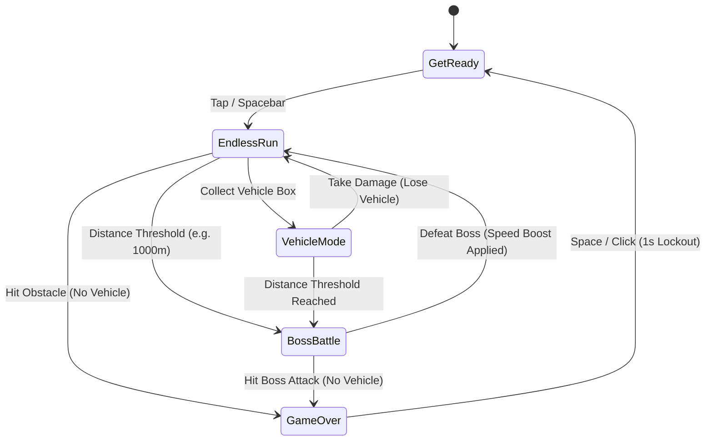
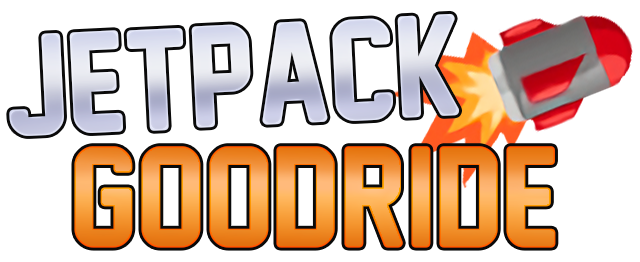
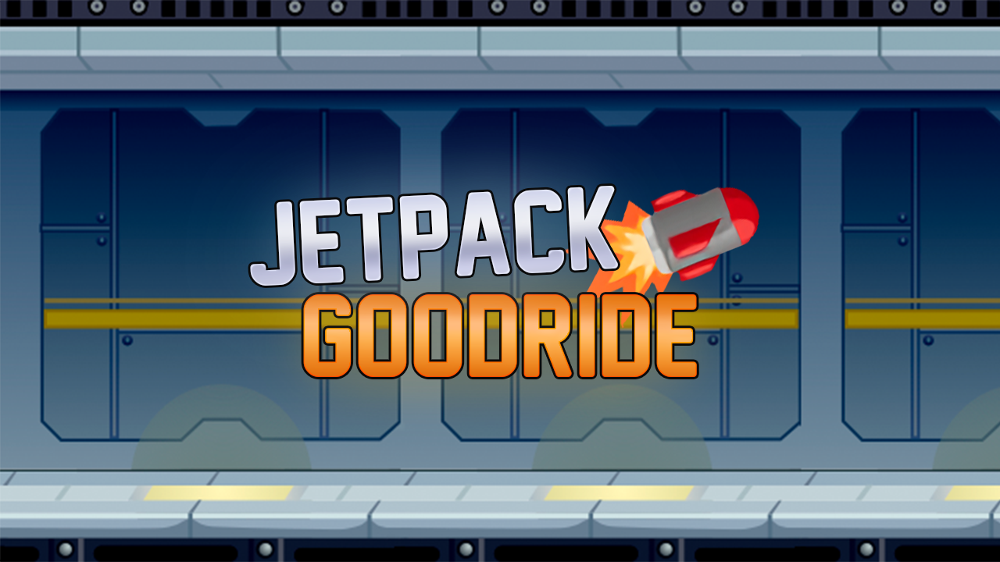
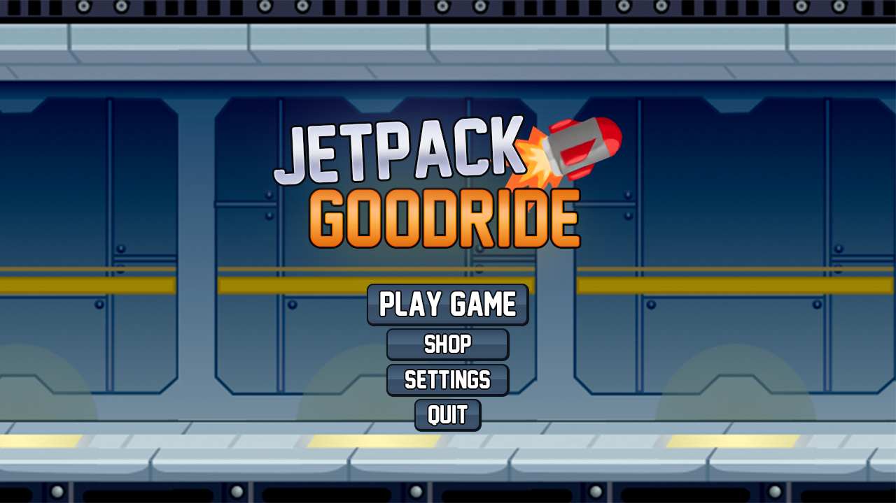
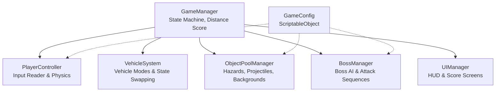

# Game Design Document — Jetpack Boss Fighter

| Field | Details |
|---|---|
| **Working title** | Jetpack Boss Fighter |
| **Team** | Nadav Simon, Alfredo Limin |
| **Genre** |Endless Runner|
| **Target platform** | WebGL |
| **Engine / Unity version** | Unity 6 (6000.3.12f1), URP 2D |
| **Orientation & reference resolution** | Landscape, 1920 × 1080 reference |
| **Expected session length** | 2 – 8 minutes |
| **Document version** | v1.0 — 2026-09-06 |

---

## 1. High Concept

An endless horizontal runner where players dodge obstacles using a one-touch jetpack and transform into three unique vehicles (Motorbike, Bird, Gravity Suit). Distance triggers seamless bullet-hell boss encounters. Defeating a boss resumes the endless run at higher speeds. No coins, shop, or boosters—just pure reflex-driven survival and distance scoring.

### Design pillars

1. **Skill Over Progression** — Zero currency, power-up shop, or permanent stat upgrades. High scores depend entirely on reflex, timing, and pattern recognition.
2. **Dynamic Input Mechanics** — Vehicle transformations fundamentally alter the single-button control scheme (continuous lift vs. grounded jump vs. flap vs. instant gravity flip), demanding instant cognitive adaptation.
3. **Unbroken Arcade Flow** — Boss encounters spawn dynamically inside the scrolling environment without scene transitions or loading screens, maintaining relentless forward momentum.

---

## 2. Reference & Inspiration

- **Primary Reference:** *Jetpack Joyride* (Halfbrick Studios).
  - **Taking:** Endless horizontal scrolling, one-touch continuous jetpack lift, destructible vehicle armor layer (taking damage destroys the current vehicle rather than killing the player).
  - **Not taking:** Coins, spin tokens, character customization, gadgets, or utility boosters.
- **Secondary Reference:** *Cuphead* (Side-scrolling boss phases) / *Flappy Bird* (Bird vehicle mechanic).
  - **Taking:** Telegraphed boss attack sequences and projectile dodging while maintaining altitude control.

---

## 3. Core Game Loop

**Moment-to-moment rules:**

- **Continuous Movement:** The camera and environment scroll left continuously. Distance traveled acts as the primary score.
- **Default Jetpack:** Holding the action button applies upward vertical force; releasing it lets gravity pull the player down.
- **Vehicle System (Single HP Buffer):**
  - **Motorbike:** Grounded vehicle. Pressing action triggers a fixed-height physics jump. Cannot fly.
  - **Profit Bird:** Air vehicle. Pressing action replaces vertical velocity with an upward impulse, mirroring Flappy Bird physics.
  - **Gravity Suit:** Heavy suit. Pressing action instantaneously flips player gravity scale between `+4.0` and `-4.0`, snapping between floor and ceiling.
- **Boss Encounter:** Every 1,000 meters, standard hazard spawning halts. A giant boss approaches from the right edge, executing telegraphed attack phases (laser beams, targeted missile bursts). Randomly floating weapon crates auto-fire targeting missiles at the boss when collected.
- **Scoring:** +1 point for every 10 meters traveled. Defeating a boss awards a flat +500 meter distance bonus.
- **Failure:** Touching a hazard (zap field, missile, boss laser) while in standard Jetpack mode results in immediate instant death. If in a vehicle, the vehicle explodes, conferring 0.5s invincibility frames while reverting the player to standard Jetpack mode.

### Parameters you will need to tune

| Parameter | What it controls | First guess |
|---|---|---|
| `baseScrollSpeed` | World scroll velocity | 12.0 u/s |
| `speedRampFactor` | Scroll speed multiplier applied after each boss defeat | 1.12x |
| `jetpackThrust` | Upward acceleration applied when holding primary input | 28.0 u/s² |
| `gravityScale` | Fall rate for standard jetpack state | 3.8 |
| `bikeJumpImpulse` | Vertical force applied on Motorbike jump | 11.5 u/s |
| `birdFlapImpulse` | Instant upward velocity replacement for Bird | 8.0 u/s |
| `bossHealth` | Total damage hits required to destroy the boss | 15 hits |
| `bossSpawnInterval` | Distance in meters between boss encounters | 1000 m |

**Where these live:** Centralized inside a `GameConfig` ScriptableObject referenced by `GameManager` and `PlayerController` for zero-recompile runtime tuning via Unity Inspector.

**Feel target:** A novice player reaches the first boss encounter (~1,000m) within 45–60 seconds; a skilled player can defeat 3 consecutive bosses as world speed scales to >20 u/s.

---

## 4. Controls & Input

| Action | Keyboard / Mouse | Gamepad | Touch Screen |
|---|---|---|---|
| **Primary Action** (Thrust / Jump / Flap / Gravity Flip) | Spacebar / Left Click | A Button / Right Trigger | Tap & Hold Anywhere |
| **Restart Game** | Spacebar / Left Click | A Button | Tap Screen |

- Input is polled during `Update()`, buffered as a struct state, and executed during `FixedUpdate()` to guarantee zero missed inputs across physics frame steps.
- UI Raycasting blocks gameplay input when interacting with screen overlay buttons.
- A **1.0-second input lockout** is enforced upon player death before restart inputs are registered, preventing accidental quick-restarts during rapid tapping.

---

## 5. Screens & UI

1. **Title / Start Screen** — Centered game logo ("Infinite Boss Ride"), high score counter, flashing "Press Space / Tap to Jetpack" prompt.
2. **HUD (In-Game)** — 
   - Top-Right: Current Distance (`1,240 m`).
   - Top-Center (Boss Active Only): Boss Name & Segmented Health Bar.
   - Vehicle Indicator (Bottom-Left): Icon showing active vehicle mode and HP shield status.
   - *Deliberately absent:* Coin counters, shop icons, or active booster timers.
3. **Game Over Screen** — Overlay panel displaying Final Distance, High Score indicator, Bosses Defeated count, and a prominent "Tap to Replay" button.

- **Canvas setup:** Screen Space – Camera, CanvasScaler *Scale With Screen Size*, reference 1920 × 1080, Match Width/Height = 0.5.

---

## 6. Art & Audio

| Asset | Description / Variants | Source & Licence | Use |
|---|---|---|---|
| **Player Sprites** | Main character animation frames (Run, Fly, Die) | Custom 2D Vector / CC0 Asset Pack | Player visualization |
| **Vehicle Sprites** | Motorbike, Bird, Gravity Suit sprites & icons | Custom / OpenGameArt (CC0) | Vehicle transformations |
| **Obstacle Sprites** | Zappers (Vertical/Horizontal), Homing Missiles | Custom / OpenGameArt (CC0) | Hazard hazards |
| **Boss Sprite** | Multi-part Mech Boss with animated turrets | Custom / OpenGameArt (CC0) | Boss encounter |
| **SFX Pack** | Jetpack hum, Jump sound, Hit blast, Boss Laser, Explosion | Freesound.org (CC0) | Audio feedback |
| **BGM Track** | Fast-paced synthwave/arcade loop | Incompetech / CC-BY 4.0 | Background soundtrack |

**Licence note:** All visual assets and sound effects utilized are created internally or sourced under CC0 / Public Domain licences, ensuring fully compliant academic presentation and build distribution.

### Asset Previews

| Logo | Splash Art | Menu Background |
|---|---|---|
|  |  |  |

| Player Fly | Player Dead | Rocket | Zapper |
|---|---|---|---|
|  |  |  |  |

**Technical art rules:**
- Pixel / Crisp Unlit Vector aesthetic (Filter Mode: Point / Bilinear depending on art style).
- Pixels Per Unit (PPU): 100.
- Explicit Sorting Layers (Back to Front): `Background` → `Decals` → `Hazards` → `Boss` → `Player` → `ForegroundUI`.

---

## 7. Technical Design

**Scenes:** Single scene setup (`MainGame.unity`). Game resets occur via internal state machine resets and object pool clearing, avoiding heavy `SceneManager.LoadScene()` reloading hitches.

**Packages / Systems Used:** Input System, Physics2D, Universal Render Pipeline (URP) 2D, TextMeshPro, ScriptableObject Architecture.

**Architecture Diagram:**

| Script Name | Single Responsibility |
|---|---|
| `GameManager` | Tracks global game state (Running, Boss, Death), distance score, and game speed scaling. |
| `PlayerController` | Handles physics forces, ground checking, and routes inputs to active vehicle profile. |
| `VehicleSystem` | Manages vehicle pickup collisions, active vehicle state, physics override, and losing vehicle armor. |
| `ObjectPoolManager` | Pre-instantiates and recycles obstacle zappers, warning indicators, and missile instances. |
| `BossManager` | Controls boss entry animation, attack pattern state machine, health tracking, and defeat sequence. |
| `UIManager` | Updates score displays, displays boss health bar during encounters, and manages game-over overlay. |
| `GameConfig` | Holds ScriptableObject parameters for speed, jump forces, gravity scales, and spawn thresholds. |

### Unity Course Features Implemented

1. **Object Pooling System (`ObjectPoolManager`)** — Used for all recurring obstacles, background scenery tiles, boss laser bolts, and player missiles. *Rationale:* Instantiating and destroying dozens of entities per minute triggers frequent Garbage Collection (GC) spikes. In a high-speed timing arcade game, a GC frame drop causes unfair player deaths.
2. **State Machine Pattern (`PlayerController` & `BossManager`)** — Applied to vehicle switching and boss behavior patterns. *Rationale:* Cleanly separates physics rules (e.g., Bird flapping vs. Motorbike jumping vs. Gravity inversion) without polluting `Update()` with nested conditional logic.
3. **ScriptableObject Configuration (`GameConfig`)** — Used to store physics constants, spawn rates, and tuning knobs. *Rationale:* Allows real-time parameter tweaking during live playtesting without modifying source code or risking git merge conflicts.

---

## 8. Scope

### 8.1 MVP — Core Playable Game
- [ ] Smooth endless horizontal parallax background scrolling with distance tracking score.
- [ ] Base Jetpack physics (Hold to thrust, release to fall).
- [ ] Basic hazard obstacle pooling (Static Electric Zappers).
- [ ] Single Boss encounter spawning at 1,000m with 1 telegraphed attack pattern.
- [ ] Collectible missile crates during boss phase to damage and defeat the boss.
- [ ] Restart loop without scene reloads.

### 8.2 Polish — Target Course Features
- [ ] Implementation of all 3 distinct vehicles (Motorbike, Profit Bird, Gravity Suit).
- [ ] Vehicle pickup boxes spawning randomly during endless run.
- [ ] Boss phase transition polish (warning siren UI, background parallax slowdown, camera shake).
- [ ] Speed scaling ramp after each successful boss defeat.
- [ ] Particle FX for jetpack sparks, explosion bursts, and vehicle destruction.

### 8.3 Explicitly Out of Scope
- **No Coins or Currency Systems:** Zero pickup coins, banking, or score-to-cash conversions.
- **No Shop or Upgrades:** No permanent upgrades, power-up purchases, or stat boosts.
- **No Character Customization:** No cosmetic skins, costumes, or jetpack visual swaps.
- **No Utility Boosters:** No head-starts, double-score boosters, or blast shields.
- **No Mobile / Touch Tilt Features:** Restricted to desktop keyboard/mouse and gamepad input specs.

---

## Changelog

| Version | Date | Change |
|---|---|---|
| v1.0 | 2026-09-06 | Finalized Game Design Document for *Infinite Boss Ride* course submission. Defined high concept, 3 vehicle mechanics, boss battle flow, technical architecture, object pooling setup, and strict scope limits. |